## Project: Detect Highway Lanes with Various CV Techniques
[](http://www.udacity.com/drive)

Overview
---


The goal of this project is to classify the drivable area of a car's lane and to calculate the estimated lane's radius of curvature and the vehicle's lateral offset from the lane's center.

Project Outline
---
* Files Submitted 
* Camera Calibration
* Image Pipeline
* Video Pipeline
* Discussion

## Files Submitted
* `advanced-lane-finding.ipynb` - the notebook contains all of the code used for advanced lane finding. All code referenced pertains to this notebook unless otherwise noted
* `write-up-images` - this directory contains all of the example output images used in this writeup
* `output-project-video.mp4` - final output video showcasing advanced lane finding techniques
* `test-images` - a directory of driving images for testing purposes
* `cal-images` - a directory of calibration images used to undistort the images taken by the camera

## Camera Calibration
The camera that is located in the front of the car needs to be undistorted, that is, to undo distortion of the image caused by the bending of the light as it passes the camera's lenses. This step involves taking several calibration images of a printed 2D chessboard with the same camera that is on the vehicle. The location of the calibration images used are stored in this repository's directory `cal-images`. A function from OpenCV is used to find the corners of the chessboard. 
```python
# Find the chessboard corners
ret, corners = cv2.findChessboardCorners(gray, (9,6), None)
```
The returned `corners` vertices are compared to a plane mesh grid of points that are evenly spaced on a flat plane (shown as `Mesh Grid of objpoints` below). 


The OpenCV function `calibrateCamera` computes the collected `objpoints` and `imgpoints` or `corners` and outputs a corrected camera matrix `mtx` and distortion coefficients `dist`.
```python
# Perform camera calibration given object points and image points
ret, mtx, dist, rvecs, tvecs = cv2.calibrateCamera(objpoints, imgpoints, img_size ,None,None)
```
Below is an example of a distortion corrected calibration image.

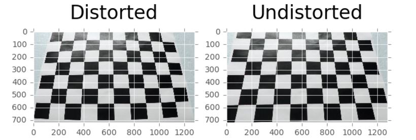


## Image Pipeline
The cell block titled `Image Pipeline Functions` holds the functions that are included in the image processing pipeline.
### Distortion Correction
Distortion must be removed from every image as the preceding steps require no distortion. In order to undistort each image the following code is used:
```python
cv2.undistort(img, mtx, dist, None, mtx)
```
Below is an example of a distortion corrected image that is part of the driving video.

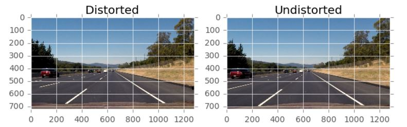

### Color Transforms/Gradients
One of the more challenging aspects of this project was selecting the image's color channel thresholds in order to find the pixels in the image that represent the lane lines. Below I discuss my technique for finding these lane line pixels and I have divided the approach into the topics: `Hue Lightness Saturation Channels` and `Red Green Blue Channels`. I found that HLS and RGB segmentation are complimentary, since HLS shows lane lines when RGB falls short, and vice versa.

#### Hue Lightness Saturation Channels
I converted each image to an HLS image and then cycled through various thresholds of each channel's pixel value. I selected the L-channel pixel threshold to be `220-255` and the S-channel pixel threshold to be `200-255`. The H-channel appeared unuseful in finding the lane lines.

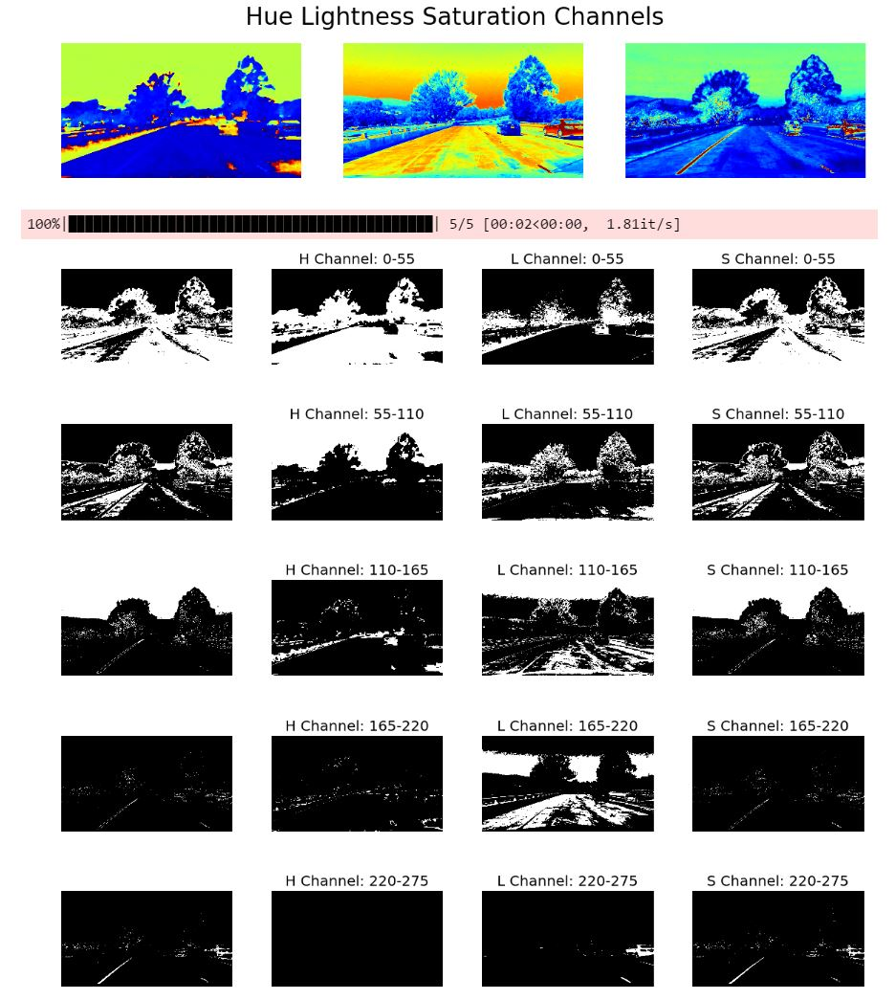

I then applied a Sobel gradient to the S-channel, along with adding the L-channel pixels to make the `Combined Binary` mask shown below

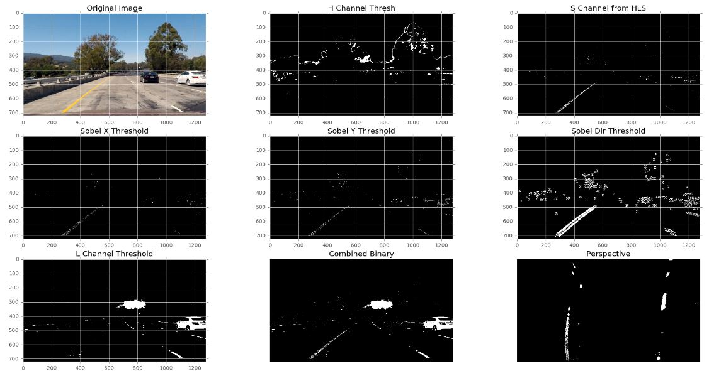

The usage of the S and L channel binary mask can be found in cell block `Image Pipeline` lines `5-16` and `28-33`

#### Red Green Blue Channels
I performed the same cycling of pixel thresholds for the RGB channels as I did for HLS. I selected the R-channel pixel threshold to be `245-255`, the G-channel pixel threshold to be `215-255`, and the B-channel pixel threshold to be `215-255`.

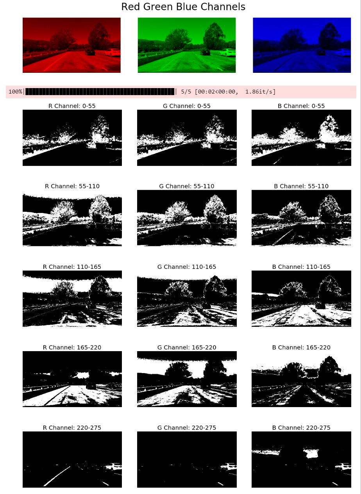

The usage of the RGB binary mask can be found in cell block `Image Pipeline` lines `17-24` and `30-32`.

### Perspective Transform
In order to compute a second order polynomial fit of the left and right lane lines, a birds-eye-view of the lane must be made. This is completed by using the OpenCV's function `applyPerspective`. The source points `src` and destination points `dst` are hard-coded and used throughout the entirety of the video (cell block `Image Pipeline Functions`, lines `74-84`). These four vertices instruct the function how much to warp an image so that it appears as if we're looking directly down on it.
The OpenCV function responsible for a perspective transform follows:
```python 
# Compute the perspective transform, M, given source and destination points
M = cv2.getPerspectiveTransform(src, dst)
# Unwarp an image using the perspective(img, M, img_size, flags=cv2.INTER_LINEAR)
cv2.warpPerspective(img, M, img_size, flags=cv2.INTER_LINEAR)
```
The second and fourth column in the image grid below show the output of applying a perspective transform.

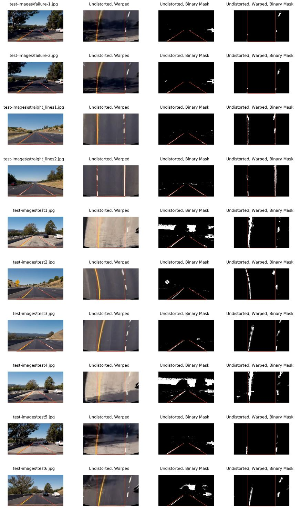

The function that is responsible for performing this perspective transform on all images is located in cell block `Image Pipeline Functions`, lines `86-92`.

### Polynomial Fit of Lane Lines
In order to perform a polynomial fit of the lane line pixels, an binary image mask is used to gather pixel indices of all non-zero pixel values for each lane line. This is performed using a Sliding Window approach, where a defined window or rectangle slides around the image 'looking' for pixel values that are non-zero within its boundary. The window proceeds to follow the lane's pixels in the image. 

After finding the left and right pixels' indices `leftx, lefty, rightx, righty` that denote the presence of a lane line, the NumPy function `polyfit` is used to fit a second-order polynomial function to those respective lane line pixels.
```python
np.polyfit(lefty, leftx, 2)
np.polyfit(righty, rightx, 2)
```
Below are a few examples where the left and right lane line pixels are colored red and blue, respectively. The yellow lines are the second-order polynomial fit. When fitting the polynomial function, only the respective lane-colored pixels are used.

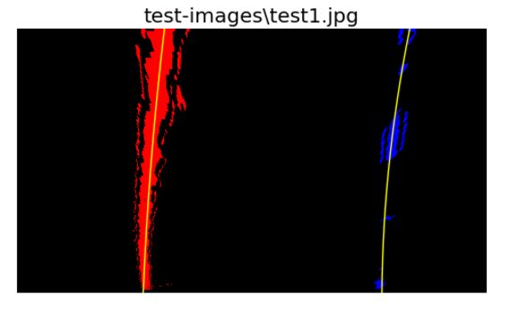

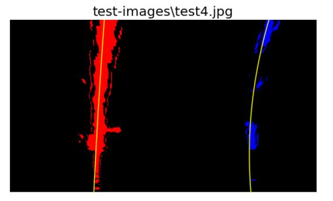

The code for the Sliding Window search can be found in cell block `Draw Lane and Stats Function`, lines `7-136`.

### Radius of Curvature
Now that the a second order polynomial line has been fit to both the left and right lane lines, the lane's radius of curvature can be found using the following equation.

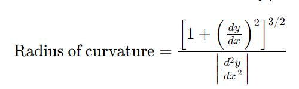

[*image source](http://www.intmath.com/applications-differentiation/8-radius-curvature.php)

In this case, the derivative is found at the bottom of the image where the fitted lane line intersects the image's bottom as this is where the front of the car lies. But before this can be calculated, the pixel space needs to be converted to meters where 720 pixels in the y-direction represents 30 meters and 700 pixels in the x-direction represents 3.7 meters.
```python
# Define conversions in x and y from pixels space to meters
ym_per_pix = 30/720 # meters per pixel in y dimension
xm_per_pix = 3.7/700 # meters per pixel in x dimension
```
Since two different radii will be calculated (one for each lane line), the average of each radius will be taken and displayed.
The code for calculating the radius of curvature can be found in cell block `Draw Lane and Stats Function`, lines `159-183`.

### Vehicle's Center Offset
Like in the previous section `Radius of Curvature`, the pixel dimension of the image was converted to meters. 
In order to calculate the vehicle's lateral offset from the center of its lane, two saved values are used from the Sliding Window search mentioned earlier. Whenever a sliding window search begins, the x-position of each lane line is saved as `base_x`. The average of these x-positions is compared to the center of the image's width. It can be assumed that the vehicle's camera is located in the vehicle's center and the calculated offset is the lateral distance between the image's width center and the lane's averaged x-position.
The code that calculates the vehicle's center offset is located in cell block `Draw Lane and Stats Function`, lines `185-191`.

### Final Plot of Lane Space and Statistics
Below are two examples where a projected lane polygon represents the drivable portion of the car's lane as well as the lane's estimated radius of curvature and the vehicle's lateral offset from the lane's center.

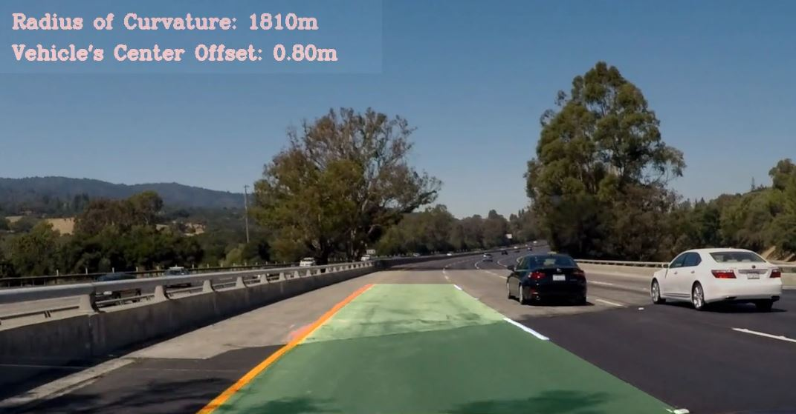

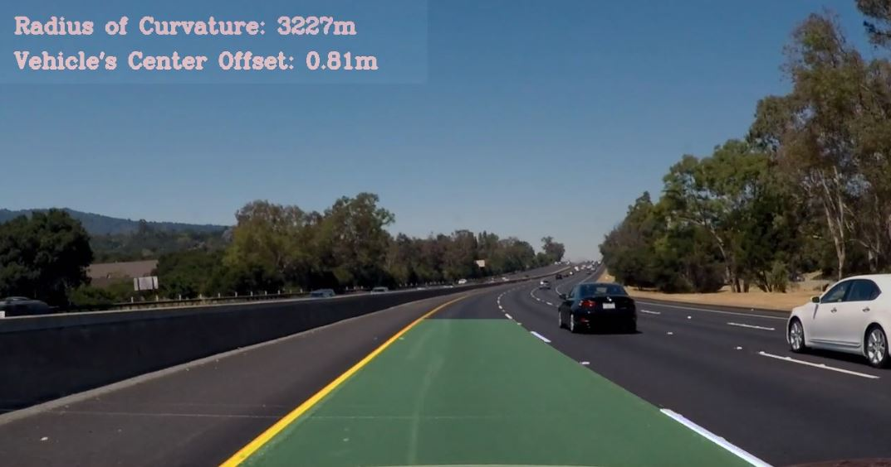

## Video Pipeline
The final video submission, `video.mp4`, was created using a python module `MoviePy`. The code below (cell block `Full Test Clip - Used for Project Submission`) takes the function `apply_lane_find` (cell block `Full Image Pipeline`) and applies it to each of the video's image frames.
```python
from moviepy.editor import VideoFileClip
clip1 = VideoFileClip(project-video.mp4')
proj_clip = clip1.fl_image(apply_lane_find)
```

## Discussion
### Catastrophic Failure
Although executing the image pipeline on a handful of test images to find the lane line pixels can be helpful, I still found a few frames in the video where the drawn lane had a catastrophic failure. In particular, the shadows cast by the road's adjacent tree created extra noise in such a fashion that the sliding window search followed the bright splotches of sunlight instead of the lane line as shown below.

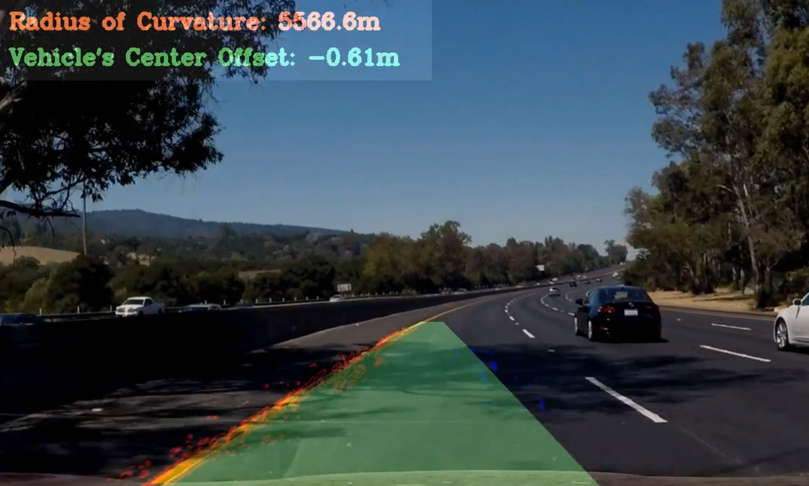

The blue color on the road represents what the algorithm thought was the right lane line. After discovering this, I proceeded to cycle through the HLS and RGB channel values in order to better filter false positives.

### Lane Line Class
As I completed the full image pipeline, I noticed that the lane coloring was very jittery. Also the radius of curvature and vehicle offset values changed so rapidly that they were hardly decipherable. As suggested by the Udacity course, I implemented a `Line Class` to save historic values of each video's frame. The code of this class can be found in cell block `Create Line Class`. The Line class is responsible for saving historic values of the video's frame where, for example, the polynomial coefficients are read in and the output is an updated average of those polynomial coefficients. A similar approach was made for the vehicle's offset value and the radius of curvature. 

### Quick Lane Search
Once I implemented a basic Sliding Window search in order to find the left and right lane line image pixels, I added a Quick Lane Search where I took advantage of the previously found lane line polynomial fit. The code for this can be found in cell block `Draw Lane and Stats Function`, lines (7-53).

### Future Improvements
I performed a considerable amount of color channel tuning in order to successfully locate the lane for 50 seconds worth of driving footage. I believe that a more efficient approach would incorporate instruction of an AI model to find lane lines. The AI model could be trained to tune the color channels automatically in order to produce a binary mask that it thinks most resembles the lane lines. The AI model could also be trained on what a lane line is using a Generative Adversarial Network as explained in comma.ai's [approach](https://github.com/commaai/research).
