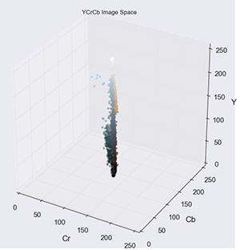
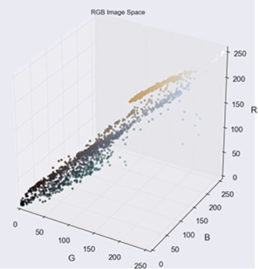
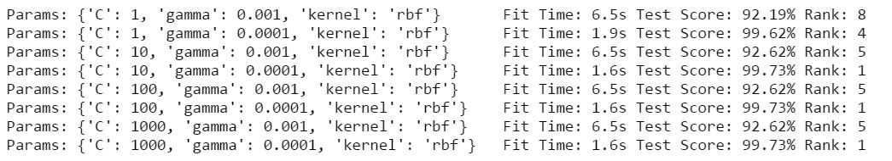
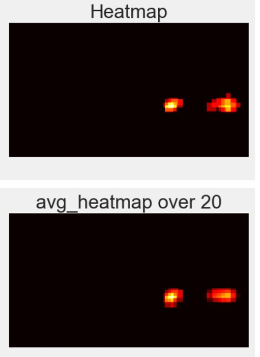
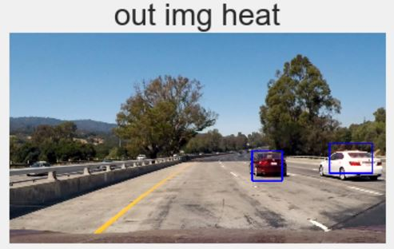

## Project: Vehicle Detection

 
Overview
---

 
The goal of this project is to detect and track vehicles on a road using a combination of machine learning and computer vision techniques.
 
Report Outline
---
* Files Submitted
* Histogram of Oriented Gradients (HOG)
* Sliding Window Search
* Video Implementation
* Discussion
---
 
## Files Submitted
* `vehicle-detection.ipnb` - the notebook contains all of the code used for vehicle detection. All code referenced pertains to this notebook
* `output-images` -  a directory that holds all supporting images used in this writeup-report
* `video.mp4` - the final output video displaying the use of vehicle detection
 
## Histogram of Oriented Gradients (HOG)
This section explores what features were selected and why as well as what machine learning model was ultimately used for vehicle detection.
### Feature Vector Selection
By taking a look at sample test image, we can easily pick out the two cars, however, the algorithm only 'sees' pixel values.
 

 
In order to help distinguish a group of pixel values that represent a car versus those that denotes a tree, for example, the image space has been separated into YCrCb values, shown below.
 

 
I chose the YCrCb image space since this space proved best among other image spaces when testing. From the graph above, the model takes advantage of the spread of values in the `Y` or luminance channel as well as the tight luminance groupings; the black car's luminance values are grouped low on the `Y` axes while the white car's values are grouped higher. Additionally, the roadside vegetation green colors and the yellow lane lines, for example, are respectively grouped together.
I took the YCrCb channel values and calculated the Histogram of Orientated Gradients (HOG) for each channel. The purpose of this comes from the utility of HOG in determining an object within an image. HOG groups pixels into cells `pix_per_cell` and then each cell into blocks `cell_per_block`. The gradient of the given pixel values are calculated within each cell and the gradient is grouped into `orient` number of bins when taking the histogram. The values are then normalized according to the `cell_per_block` size.
I found the following values reliably detected vehicles and the absence of vehicles from a given set of test images.
 
HOG Parameter | Value
--------------|-------
`pix_per_cell`| 16
`cell_per_block`|2
`orient`    	|9
 
The image grid below shows the contrasts of a car and non-car image that have both underwent a HOG operation. The values I chose for the HOG function reliably highlight the signatures of a car such as where the hood of the car begins or the stark contrast between the ground and the bottom of the car. When compared to the HOG output of a non-car image, it is clear that the HOG parameters are able to grasp the overall shape of the car and even the stark change in gradient from the car's taillight or license plate. A non-car HOG output may show edges, however, it does not contain or exhibit the overall rectangular shape of the car.
 

 
The code for implementing HOG is shown in cell block `Functions`, lines `1-19`.
 
In addition to collecting HOG values as part of the feature vector, the RGB pixel values of an image are added in two ways: by collecting the pixel values of an image as well as the histogram of each RGB channel and concatenating both unraveled vectors to the feature vector. When looking at the RGB color space for a given test image, the color of the cars tend to be vibrant colors when contrasted with the surrounding road, scenery, etc.
 

 

 
Collecting the RGB pixel values is implementing in cell block `Functions`, lines `21-26` and the RGB histogram values are shown in lines `28-38`.
 
### Support Vector Machine (SVM) Model
As mentioned in the section directly before, a feature vector is collected from each sampling of a test-image. This feature vector contained the values of the HOG output, RGB pixel values, and the histogram output of the RGB values. The length of this vector is 4140. A Support Vector Machine model was chosen as this type of model is well suited for this type of car/not-car classification challenge and a SVM creates the starkest decision boundary within a reasonable training time of 8 seconds over two thousand images.
 
The training data was a collection of car and non-car images, about one thousand for each.
 

 
The feature vector is extracted from each of the training/test images and Sklearn’s Standard Scaler was applied. In order to efficiently train the SVM model, this scaler object alters the columns of each feature vector so that the column-wise mean is zero with a unit variance. The code for scaling the training/test images is in cell block `Create Model`, lines `31-34`.
 
Given that SVM models have numerous hyperparameters to select, the Python library Sklearn's GridSearchCV was used to test out the following combination of parameters.
 

 
The best parameters in regards to the best test score and training time follows:
 
Parameter | Value
---------|------
Kernel | `RBF`
C | `10`
gamma | `0.0001`
 
 
## Sliding Window Search
In order to determine if a vehicle is present in an image, a Sliding Window Search technique was used. Rather than searching the entire image at once for the presence of a vehicle a small, fixed-sized window slides across the image extracting the pixel values. Furthermore, three different window scales were used and each window scale only searched parts of the image, as shown below:
 

 
The image below helps illustrate a window sliding across a subsection of the original image where each grid color represents a different window scale and corresponding image subsection.
 

 
The scaling of the window was selected based on various testing. I found that small window scales (less than 0.7) produced spurious false positives while large window scales (more than 1.2) appeared to overwhelm the overall vehicle detection space by creating large overlaps into non-vehicle space.
 
As a window slides over its grid space, it extracts the feature vector within the window's boundaries. To help expedite the HOG extraction, the HOG output is performed only once for each image. The sliding window then subsamples parts of the entire HOG output as the window traverses its grid space.
 
An important parameter selection was how much the window slides across the image every time it performs a new feature vector extraction. This value was determined empirically to be 32 pixels. If the window traversed just 16 pixels, the overall speed of the feature vector extraction was reduced considerably without any noticeable improvement in vehicle detections. If the window traversed 64 pixels, the detection space appeared to be too sparse and at times caused a single vehicle to be interpreted as two or three separate vehicles.
 
Once the feature vector is extracted, the SVM model tests if there is a vehicle. If the model predicts a vehicle, that window space is added to a heatmap and an accumulation of positive vehicle detections begins to form as shown below:
 

 
The code for calling multiple feature vector extractions with various windows sized can be found in code block `Heatmaps` in the function `heatmap`. The feature vector extraction takes place in code block `HOG/Pixel Subsamplilng Function` in the function `find_cars`.
 
### Pipeline Optimizations
In order to filter out false positive vehicle detections, a threshold was applied to each heatmap. This threshold dropped parts of the produced heatmap that accrued only one positive vehicle detection. The implementation is located in cell block `Pipeline Helper Functions`, lines `1-4` and is called from cell block `Heatmaps`, lines `21-22`.
 
I noticed a *Bermuda Triangle* of loss vehicle detections at a medium range distance within the driving footage. As a vehicle would pass about 30-50m ahead, its detection would slowly fade away. I implemented a more spatially narrow, small-scaled window search in this area as shown as a red grid below:
 

 
## Video Implementation
A vehicle tracking class `VehicleTracker` was created to organize all the functions needed in the processing pipeline. The class is created in cell block `Create Vehicle Tracker Class`. At a basic level, a single class is created to handle each image frame that is supplied from a driving video. The image is passed through processing functions that extract any and all feature vectors from the image and applies the findings to a heatmap. As heatmaps are collected from each image, an average over the last 20 stored heatmaps is created. This not only produced smoother heatmap drawings and less jittery bounding boxes, but it also helped ignore single vehicle detections by relying on a concentration of detections. I chose to store the last 20 heatmaps because this retained enough historic detections from surrounding vehicles so as to not miss (low frame count) or lag fast moving vehicles (high frame count). I implemented this filtering within the VehicleTracker class (cell block `Create Vehicle Tracker Class`, lines `15-19`.
 

 
In order to group a concentration of vehicle detections into a single bounding box, SciPy's `label()` function was used as this helped determine the boundaries of a collection of pixels as shown below:
 

 
The code for heatmap labeling is located in cell block `Create Vehicle Tracker Class`, lines `26-27`.
 
By taking the combination of an averaged, labeled heatmap a bounding box was drawn to fit the labeled heatmap sections and the heatmap window sections were overlaid to output the final vehicle detection images:
 

 

 
A 50 second driving video was used to demonstrate the entirety of the vehicle detection project. The video is named `video.mp4`.

## Discussion
 
A large hindrance to the overall pipeline is the slow processing rate of 1.3 frames a second. This is due in large part to the HOG operation even after subsampling was performed: a HOG operation was performed on the entire image and then a sliding window would subsample from that initial HOG output. I believe a faster approach would entail taking advantage of the relatively slow speed the vehicle takes when traversing through the video. For example, instead of performing a robust feature extraction for every single frame of the video, the operation could extract a much smaller (and thus quicker) feature vector and/or increase the sliding window stride until a car is detected. At that point an increase in processing could begin just at that location of the image in order to keep track of the vehicle. I would think of this as a sleep mode -- the searching operation is fast and efficient until a evidence of vehicle, pedestrian, etc. is detected, then the detection processing would deploy a more robust detection algorithm to establish and track the object of interest. Even after detecting a vehicle, the operation could once again drop into its sleep mode since a passing vehicle doesn’t change quickly in pixel space.

In addition to improving the speed of the frame-by-frame processing, the faster OpenCV implementation of HOG extraction can be used: HOGDescripter, although documentation for it appears to be sparse.

In regards to the feature vector that is used by the SVM model, the information gain could be calculated in order to find the most prominent features in an image that the SVM could take a advantage of. 

A large drawback of the current vehicle detection implementation is the phenomenon of object permanence: an object continues to exist after being obscured by another object. The heatmap that keeps tracks of vehicles in an image is limited to a 2-dimensional plane. As seen the video, the white car merges or becomes lost with the black car when the white car becomes hidden from view. This is an example of the algorithm not exhibiting the ability of object permanence and is a crucial failure if a self-driving vehicle fails to ‘remember’ vehicles or objects that are temporarily obscured from its view.

